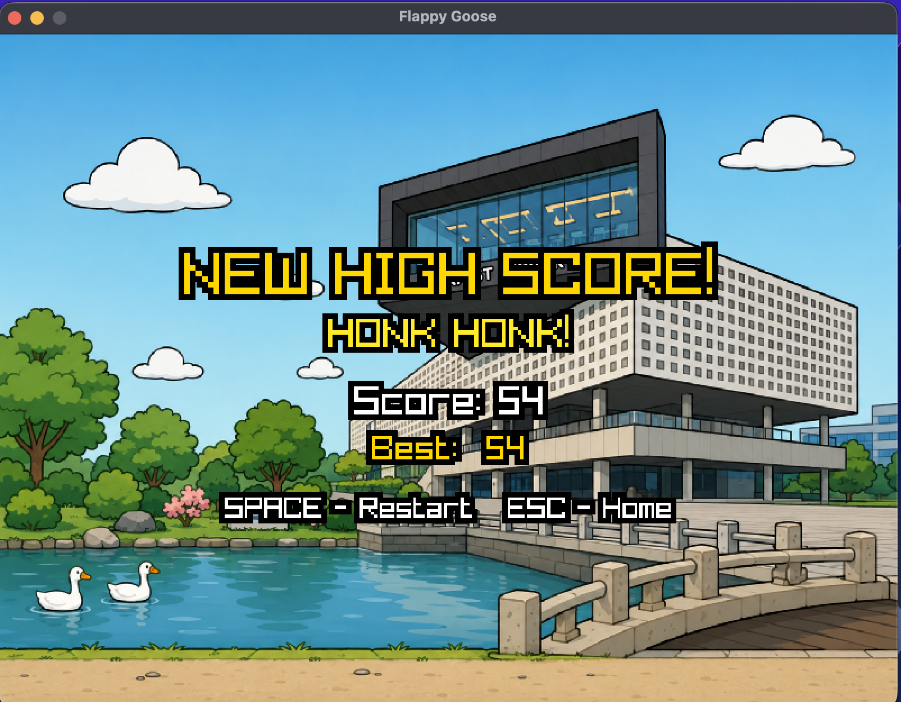

# Flappy Goose

**Flappy Goose** is a KAIST-themed Flappy Bird-style game written in **F#** using **.NET 10** and **Raylib-cs**.

The player controls a goose flying near the KAIST goose pond. Instead of classic green pipes, the obstacles are inspired by the tall three-color KAIST monument. The game includes a stage system where gravity changes randomly between stages, forcing the player to adapt to a new flying behavior.

---

## 1. Project Overview

In Flappy Goose, the player presses `Space` to make the goose flap upward. Gravity pulls the goose downward. The goal is to fly through gaps in KAIST monument obstacles and survive for as long as possible.

The game is divided into stages:

1. The first stage uses normal gravity.
2. After each stage, the game enters a transition phase.
3. During transition, no obstacles appear and the goose is temporarily immortal.
4. A new random gravity value is selected for the next stage.
5. After approximately 3 seconds, the next stage begins.

The player earns points by passing obstacles. When the goose collides with an obstacle or leaves the screen during normal gameplay, the game ends. The final score is compared with the current high score.

---

## 2. Gameplay Showcase



**My current high score is 54. Try to beat me! :D**

---

## 3. Features

- Graphical game window with an 800x600 virtual render pipeline
- KAIST-themed goose character
- KAIST monument-inspired obstacles
- Space-to-flap control
- Gravity-based movement
- Stage-based bounded random gravity variation
- Biased gap movement that tends to alternate screen halves
- 3-second safe transition phase between stages
- Score counter
- Stage counter
- Session high-score tracking
- Mid-run high-score HUD feedback when the record is beaten
- Special game-over screen for a new high score
- Restart and return-to-home-screen flow
- Pause feature with `Esc`
- Death animation before the result screen
- 3-second countdown timer when resuming from pause
- Progressive obstacle spacing that increases slower at higher speeds
- Thick sprite and text outlines for readability

---

## 4. Installation and Run Instructions

Follow this section to install dependencies and run the game from a fresh clone.

### 4.1 Requirements

This project requires:

- **.NET 10 SDK**
- **F#**, included with the .NET SDK
- **Raylib-cs** package dependencies restored through `dotnet restore`
- A desktop environment capable of opening a graphical window

This game opens a real graphical window. It should be run from a desktop session. If you are using SSH, a cloud VM, a headless server, or a terminal without a graphical display, the project may build successfully but fail to open a window.

Check whether a display is available on Linux/macOS:

```bash
echo $DISPLAY
```

If this prints nothing, run the game on a machine with a graphical desktop environment.

### 4.2 Install .NET 10 SDK

First check whether .NET is already installed:

```bash
dotnet --version
```

If the command is not found, install the **.NET 10 SDK** for your operating system.

#### Windows

Using Windows Package Manager:

```powershell
winget install Microsoft.DotNet.SDK.10
```

Then verify:

```powershell
dotnet --version
```

#### macOS

Using Homebrew:

```bash
brew install dotnet
```

Then verify:

```bash
dotnet --version
```

#### Linux

On Ubuntu/Debian:

```bash
sudo apt update
sudo apt install -y dotnet-sdk-10.0
```

On Fedora/RHEL:

```bash
sudo dnf install -y dotnet-sdk-10.0
```

On Arch Linux:

```bash
sudo pacman -S dotnet-sdk
```

Then verify:

```bash
dotnet --version
```

If the package is not available from your package manager, install the SDK from Microsoft's .NET download page.

### 4.3 Clone the Repository

```bash
git clone https://github.com/bmh4126/Flappy-Goose.git
cd Flappy-Goose
```

### 4.4 Restore and Build

For macOS and Windows:

```bash
dotnet restore
dotnet build
```

For Linux, prefer restoring with a Linux runtime identifier so Raylib's native library is restored correctly:

```bash
dotnet restore -r linux-x64
dotnet build
```

### 4.5 Run the Game

#### macOS / Windows: normal run

```bash
dotnet run
```

#### macOS / Windows: runtime-specific run if needed

If `dotnet run` fails with a missing Raylib native library error, run with your platform runtime identifier.

Windows x64:

```powershell
dotnet restore -r win-x64
dotnet run -r win-x64
```

macOS Apple Silicon:

```bash
dotnet restore -r osx-arm64
dotnet run -r osx-arm64
```

macOS Intel:

```bash
dotnet restore -r osx-x64
dotnet run -r osx-x64
```

#### Linux: recommended run

```bash
dotnet restore -r linux-x64
dotnet run -r linux-x64
```

If this is a fresh Ubuntu/Debian machine, install common graphics/audio libraries:

```bash
sudo apt update
sudo apt install -y libgl1 libx11-6 libxcursor1 libxrandr2 libxinerama1 libxi6
sudo apt install -y libasound2t64 || sudo apt install -y libasound2
```

Then run again:

```bash
dotnet run -r linux-x64
```

### 4.6 Alternative: Publish and Run

If `dotnet run` does not work, publish the game first.

Linux x64:

```bash
dotnet publish -c Release -r linux-x64 --self-contained false
./bin/Release/net10.0/linux-x64/publish/FlappyGoose
```

Windows x64:

```powershell
dotnet publish -c Release -r win-x64 --self-contained false
.\bin\Release\net10.0\win-x64\publish\FlappyGoose.exe
```

macOS Apple Silicon:

```bash
dotnet publish -c Release -r osx-arm64 --self-contained false
./bin/Release/net10.0/osx-arm64/publish/FlappyGoose
```

macOS Intel:

```bash
dotnet publish -c Release -r osx-x64 --self-contained false
./bin/Release/net10.0/osx-x64/publish/FlappyGoose
```

If the executable name is different, list the publish folder and run the executable shown there:

```bash
ls bin/Release/net10.0/linux-x64/publish/
```

### 4.7 Native Raylib Library Note

This project uses `Raylib-cs` for graphics. `Raylib-cs` is the .NET binding, but the native Raylib library must also be available at runtime.

If you see an error like this:

```text
System.DllNotFoundException: Unable to load shared library 'raylib' or one of its dependencies
libraylib.so: cannot open shared object file: No such file or directory
```

use a runtime-specific command:

| Platform | Command |
| --- | --- |
| Windows x64 | `dotnet run -r win-x64` |
| macOS Apple Silicon | `dotnet run -r osx-arm64` |
| macOS Intel | `dotnet run -r osx-x64` |
| Linux x64 | `dotnet run -r linux-x64` |

For Linux, also install the common graphics/audio libraries listed in Section 4.5.

---

## 5. Controls

| Key | Action |
| --- | --- |
| `Space` | Start game from Home, flap during Playing and Transition, resume from Pause, restart from result screens |
| `Esc` | Quit from Home, pause during Playing or Transition, return to Home from Pause or result screens |

### Pause Behavior

- Press `Esc` during gameplay to pause.
- Press `Space` to resume with a 3-second countdown.
- Press `Esc` from the pause screen to return to the home screen.
- The countdown displays the current game state so you can see where the goose is before continuing.

The exact key bindings are also displayed inside the game window.

---

## 6. Game Screens

### 6.1 Home Screen

The home screen displays:

- Game title: **Flappy Goose**
- Current high score
- Instructions for starting the game

Press `Space` to begin a new game.

### 6.2 Gameplay Screen

During gameplay, the screen displays:

- Goose character
- KAIST monument obstacles
- Current score
- Current stage number
- Background near the goose pond
- `PRESS ESC TO PAUSE` instruction

The player must guide the goose through the obstacle gaps.

### 6.3 Pause Screen

The pause screen displays:

- Current score
- Current high score, unless the player has already beaten it in the current run
- `NEW HIGH SCORE` if the current run has beaten the previous high score
- Instruction to press `Space` to continue
- Instruction to press `Esc` to return home

### 6.4 Transition Screen

After the player passes all obstacles in a stage, the game enters a transition phase.

During this phase:

- No obstacles are on screen
- The goose is immortal and cannot die
- A gravity-shift message is displayed
- The new gravity value for the next stage is displayed
- A countdown timer is displayed
- The next stage's gravity is selected from a bounded random range tuned by stage
- The goose is highlighted with a yellow immortal-state effect

Before this phase begins, the last obstacles from the previous stage are allowed to move fully off-screen. Once the transition starts, the screen is clear for approximately 3 seconds, then the next stage begins with new obstacles generated using the selected gravity.

### 6.5 Normal Game Over Screen

If the final score is not greater than the current high score, the normal game-over screen displays:

- Final score
- Current high score
- Restart instruction

Press `Space` to restart or `Esc` to return home.

### 6.6 New High Score Screen

If the final score is greater than the previous high score, a special game-over screen displays:

- Congratulation message
- Final score
- New high score
- Restart instruction

Press `Space` to restart or `Esc` to return home.

---

## 7. Gameplay Rules

1. The goose starts on the left side of the screen.
2. Gravity continuously pulls the goose downward.
3. Pressing `Space` gives the goose upward velocity.
4. Monument obstacles move from right to left.
5. Each obstacle has one open gap.
6. The player earns 1 point after successfully passing an obstacle.
7. The player loses if the goose collides with an obstacle during normal gameplay.
8. The player loses if the goose moves outside the top or bottom boundary during normal gameplay.
9. Each stage contains 5 obstacles in stage 1, 6 in stage 2, and 7 from stage 3 onward.
10. During transition, the goose cannot die.
11. After the last obstacle in a stage is passed, the remaining stage obstacles continue moving until they are fully off-screen, and only then does the transition phase begin.
12. After transition, a new stage begins with a new gravity value.
13. Gap positions are biased to alternate sides.
14. The high score is updated only when the final score is greater than the previous high score.
15. The game can be paused with `Esc` during Playing or Transition screens, with a 3-second countdown before resuming.

---

## 8. High Score System

The game tracks a high score during the current program session.

- The high score starts at 0 when the program opens.
- The home screen displays the current high score.
- After each game, the final score is compared with the high score.
- If the final score is higher, the high score is updated.
- If the player returns to the home screen, the updated high score is displayed.
- Closing and reopening the program may reset the high score to 0.

The high score is intentionally session-based. It is not required to persist after the program closes.

---

## 9. Obstacle and Collision Design

The visible obstacle is a KAIST monument-inspired image.

For simpler and fairer gameplay, collision detection does not use the exact visual shape of the monument. Instead, each obstacle uses two invisible rectangular hitboxes:

1. A top rectangle above the gap
2. A bottom rectangle below the gap

The goose can safely pass through the gap between these two rectangles.

This design keeps the gameplay readable and avoids unfair collisions with decorative visual details.

---

## 10. Random Gravity and Fairness

The game uses stage-based gravity variation to gradually increase difficulty.

### 10.1 Gravity Variation by Stage

Gravity change is calculated as a percentage of the gravity range.

The current game uses a bounded gravity range of:

```text
minimum gravity: 600
maximum gravity: 3500
```

Stage behavior:

- Stage 1: gravity changes by 0-10% of range
- Stage 2: gravity changes by 10-25% of range
- Stage 3: gravity changes by 20-40% of range
- Stage 4: gravity changes by 30-55% of range
- Stage 5+: gravity changes by 40-70% of range

### 10.2 Gravity Selection Logic

1. A random change amount is selected within the stage's range.
2. A direction, increase or decrease, is randomly chosen.
3. If the new gravity stays within bounds, it is accepted.
4. If it goes outside bounds, the opposite direction is tried.
5. If both directions overflow, the direction producing the larger absolute change from current gravity is chosen and then clamped.

This ensures gravity changes meaningfully while staying within playable bounds.

### 10.3 Fair Obstacle Design

- The obstacle gap is large enough for the goose to pass through.
- Gap positions are generated within safe vertical bounds.
- The first obstacle of each stage uses the full legal gap range.
- Later obstacles are biased to alternate between upper and lower screen halves.
- Obstacle speed increases gradually as stages progress.
- Obstacle spacing increases with speed.
- The transition phase gives the player time to adapt to new gravity before obstacles return.
- During transition, the goose is highlighted with a yellow glow for better visibility.

---

## 11. Project Structure

```text
FlappyGoose/
├── README.md
├── AGENTS.md
├── FlappyGoose.fsproj
├── src/
│   ├── Program.fs
│   ├── GameTypes.fs
│   ├── Constants.fs
│   ├── Collision.fs
│   ├── GameLogic.fs
│   ├── Assets.fs
│   └── Rendering.fs
├── Assets/
│   ├── goose.png
│   ├── goose_flap.png
│   ├── monument_obstacle.png
│   ├── lights_ring.png
│   ├── background.png
│   └── screenshot_high_score.png
└── docs/
    ├── Requirements.pdf
    └── requirements.md
```

File roles:

- `Program.fs`: main game loop and application entry point
- `GameTypes.fs`: game state, goose, obstacle, phase, and screen types
- `Constants.fs`: screen size, gravity, speed, spacing, outline, and tuning constants
- `Collision.fs`: rectangular collision logic
- `GameLogic.fs`: physics, scoring, collision, stage transition, and high-score logic
- `Assets.fs`: asset loading and unloading
- `Rendering.fs`: drawing the goose, background, obstacles, UI text, and screens
- `Assets/`: image files used by the game

---

## 12. Requirement Mapping

| Requirement Area | Implementation Behavior |
| --- | --- |
| Home screen | The game starts at a home screen showing the title and high score. |
| Player control | The player presses `Space` to flap upward. |
| Gravity | The goose is continuously pulled downward by gravity, with stage-based variation. |
| Obstacles | KAIST monument obstacles move from right to left. |
| Collision | Two invisible rectangles are used for each obstacle. |
| Scoring | Passing an obstacle increases the score by 1. |
| Stage system | After all obstacles in a stage are passed, the stage waits for its last obstacles to clear, then enters transition. |
| Transition | Transition lasts approximately 3 seconds, shows the next gravity, and disables losing. |
| Random gravity | Gravity varies by bounded per-stage percentage ranges. |
| Gap variation | Gap positions are biased to alternate between upper and lower halves. |
| Game over | Collision or leaving the screen during normal play ends the game. |
| High score | Final score is compared with the session high score. |
| New high score | A special congratulation screen appears when the high score is beaten. |
| Restart | The player presses `Space` on the result screen to restart. |
| Home return | The player presses `Esc` on the result screen to return home. |
| Pause feature | The player can pause during gameplay with `Esc` and resume with a 3-second countdown. |

---

## 13. Development Notes

The game is intentionally designed to be small and focused.

The main goal is not to build a large game engine, but to implement a clear, playable game that satisfies the requirements document. The visual theme is KAIST-specific, but the core mechanics are kept simple:

- one-button movement
- rectangular collision
- stage-based gravity changes with cumulative difficulty scaling
- probability-biased gap positioning
- score and high-score tracking
- pause functionality with resume countdown

### 13.1 Window Rendering

The game uses a `RenderTexture2D`-based rendering pipeline that maintains a logical 800x600 game coordinate system. The scene is rendered to a virtual texture and then drawn with aspect-ratio-preserving letterboxing.

### 13.2 Fullscreen / Resizable Window

Fullscreen mode is not available in the current build. The current build opens a fixed-size window. The rendering path is structured so letterboxed scaling could be enabled later if window resizing is reintroduced.

---

## 14. Known Limitations

- The high score is stored only during the current program session.
- The game is designed for desktop execution.
- Collision uses simplified rectangular hitboxes instead of exact pixel-perfect monument shapes.
- Fullscreen mode is not available.
- The current build does not enable a resizable window.
- The game requires a graphical desktop session.

---

## 15. Troubleshooting

### 15.1 `dotnet` command not found

Install the .NET 10 SDK and make sure `dotnet` is available in your terminal path.

Check installation:

```bash
dotnet --version
```

### 15.2 The project does not build

Try restoring dependencies:

```bash
dotnet restore
dotnet build
```

On Linux, prefer:

```bash
dotnet restore -r linux-x64
dotnet build
```

### 15.3 Linux error: `System.DllNotFoundException: Unable to load shared library 'raylib'`

This game uses `Raylib-cs` for graphics. `Raylib-cs` is the .NET binding, but the native Raylib shared library must also be available at runtime.

On some fresh Linux installations, plain `dotnet run` may fail with an error similar to:

```text
System.DllNotFoundException: Unable to load shared library 'raylib' or one of its dependencies
libraylib.so: cannot open shared object file: No such file or directory
```

Use the Linux runtime identifier:

```bash
dotnet restore -r linux-x64
dotnet run -r linux-x64
```

If it still fails, install common graphics/audio dependencies:

```bash
sudo apt update
sudo apt install -y libgl1 libx11-6 libxcursor1 libxrandr2 libxinerama1 libxi6
sudo apt install -y libasound2t64 || sudo apt install -y libasound2
```

Then run again:

```bash
dotnet run -r linux-x64
```

### 15.4 Missing Raylib native library on macOS or Windows

This is less common than on Linux, but it can happen if the native Raylib library is not restored for the correct platform.

Use the runtime identifier for your system:

Windows x64:

```powershell
dotnet restore -r win-x64
dotnet run -r win-x64
```

macOS Apple Silicon:

```bash
dotnet restore -r osx-arm64
dotnet run -r osx-arm64
```

macOS Intel:

```bash
dotnet restore -r osx-x64
dotnet run -r osx-x64
```

### 15.5 The game window does not open

Make sure you are running the project on a desktop environment with graphical window support.

If running through SSH, a cloud VM, or a headless server, the graphical window may not open.

Check:

```bash
echo $DISPLAY
```

If this prints nothing, run the game on a machine with a graphical desktop environment.

### 15.6 Assets are missing

Make sure the `Assets/` directory is present and includes:

```text
goose.png
goose_flap.png
monument_obstacle.png
lights_ring.png
background.png
screenshot_high_score.png
```

### 15.7 Clean rebuild

If the build behaves strangely, run:

```bash
dotnet clean
dotnet restore
dotnet build
```

On Linux:

```bash
dotnet clean
dotnet restore -r linux-x64
dotnet build
dotnet run -r linux-x64
```

---

## 16. Changes from Original Proposal

The final implementation keeps the same core Flappy Goose idea from the proposal, but several details were refined during development for usability, balancing, and presentation.

| Area | Original proposal | Final implementation | Reason |
| --- | --- | --- | --- |
| Controls | The proposal described a start key, Space to flap, and keys for restart/home behavior. | The game uses only `Space` and `Esc`: `Space` starts, flaps, resumes, and restarts; `Esc` quits from Home, pauses during play, and returns home from pause or result screens. | Simplifies the control scheme and keeps the game playable with two keys. |
| Pause flow | No pause screen was described. | Added a pause screen and a 3-second resume countdown. | Improves usability without changing the core gameplay loop. |
| Window behavior | Proposal only required a graphical window. | The game renders through a virtual 800x600 canvas with letterboxing logic, but the current build still opens a fixed-size window. | Keeps rendering stable and leaves room for future resizing support. |
| Visual readability | Proposal focused on basic rendering. | Added thick outlines for sprites and text, plus ring overlays on obstacle gap edges. | Makes the goose, UI, and obstacle openings easier to read. |
| Transition visuals | Proposal required an immortal transition message and countdown. | Transition also gives the goose a yellow immortal overlay and shows the next gravity value. | Reinforces the temporary safe state and communicates the stage change clearly. |
| Stage size | Proposal suggested fixed stage obstacle counts. | Stage 1 has 5 obstacles, stage 2 has 6, and stage 3 onward has 7. | Adds progression while keeping stage length bounded. |
| Transition timing | Proposal said transition starts after all stage obstacles are passed and no obstacles appear during it. | After the stage quota is passed, the remaining stage obstacles finish leaving the screen first; then the 3-second obstacle-free transition begins. | Prevents abrupt obstacle disappearance while still honoring a clear transition phase. |
| Obstacle generation | Proposal suggested bounded random gaps and a max-shift style fairness rule. | The first obstacle of each stage uses the full legal gap range, then later gaps are biased to alternate screen halves with stage-dependent probability; spacing also increases with speed. | Produces readable variety and better pacing than purely local random shifts. |
| Gravity tuning | Proposal required safe bounded random gravity. | Gravity uses a bounded range and stage-based percentage bands. | Keeps stage changes noticeable but still playable. |
| Death and result flow | Proposal moved directly from failure to game-over screens. | Added a short falling death animation before showing `GameOver` or `NewHighScore`. | Gives failure states a clearer visual transition. |
| High-score HUD | Proposal required home and game-over high-score displays. | During gameplay and pause, the HUD changes when the player beats the previous session best. | Gives immediate feedback when a run becomes a new record. |

---

## 17. LLM Usage

Large language models were used during development of this project.

LLM assistance was used for:

- brainstorming the game concept
- refining the KAIST-themed Flappy Goose idea
- drafting the requirements document
- drafting this README
- discussing possible implementation structure
- reasoning about fair obstacle generation and collision design

Manual work was still required for:

- deciding the final game design
- checking that the requirements are concrete and testable
- implementing the F# code
- testing gameplay behavior
- adjusting gravity, obstacle gaps, speed, and collision boxes
- verifying that the final implementation matches the submitted requirements

The main difficulty with LLM assistance was that visual design suggestions sometimes needed correction.

---

## 18. License and Asset Notice

All source code and assets included in this repository are intended for this course project.

The game is inspired by the general mechanics of Flappy Bird, but uses original project-specific code and KAIST-themed visual assets. The project does not include copied Flappy Bird source code or original Flappy Bird assets.

---

## 19. Author

Name: `Bui Minh Hieu`

Student ID: `20240942`

Course: CS-20200 Programming Principles, Spring 2026
